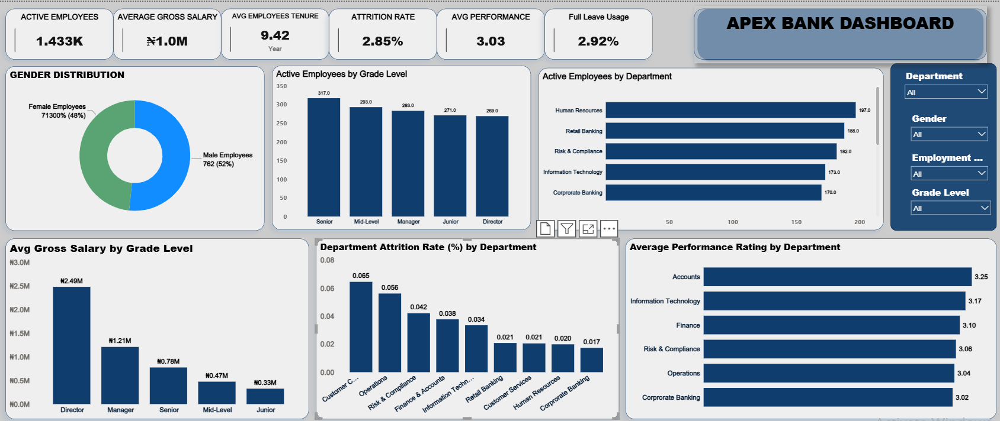
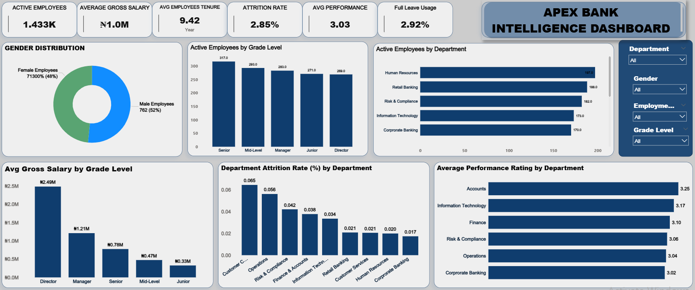
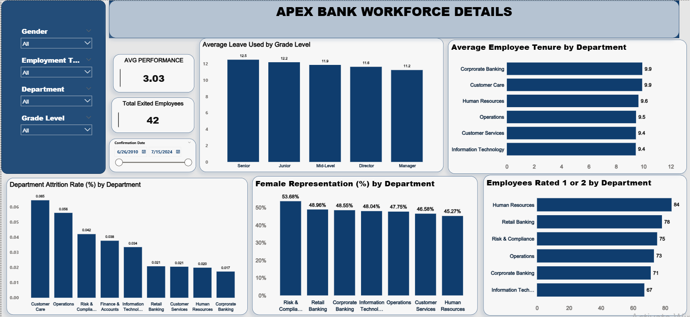
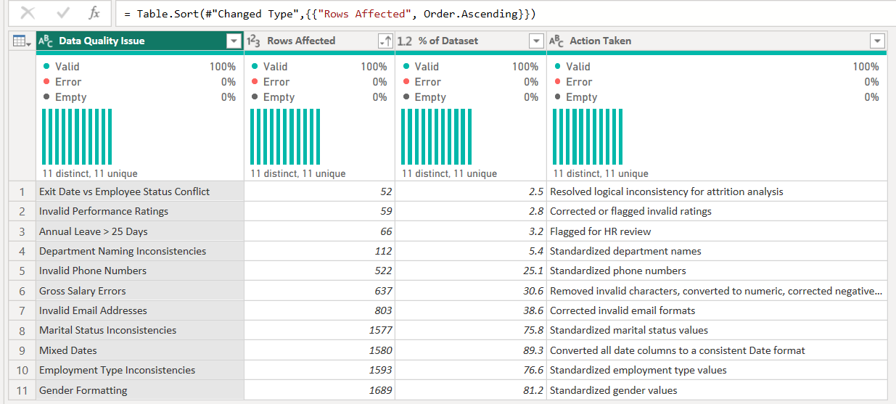
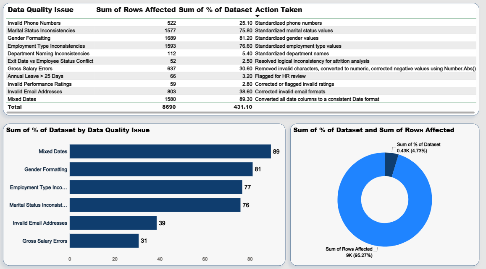
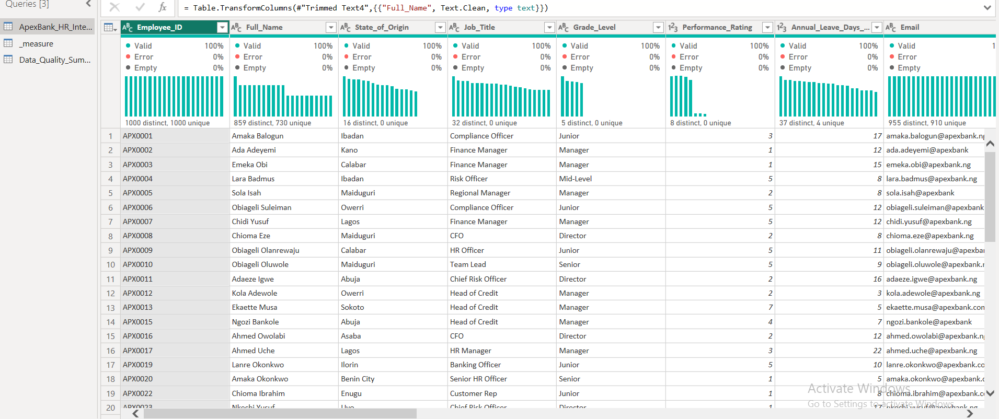
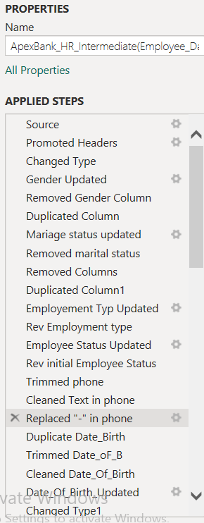

# Apex Bank Workforce Intelligence Dashboard

> **An interactive Power BI solution for analyzing workforce composition, compensation, performance, tenure, attrition, leave utilization, and HR data quality..**
-

## Executive Summary

Human Resources teams need more than employee records to make informed workforce decisions. They need a reliable view of 
**who is in the organization, where employees are concentrated, how compensation varies, where performance concerns exist, and where employee exits are occurring**.

This project analyzes an Apex Bank employee dataset containing **2,080 employee records across 20 fields** and transforms the raw HR data into an interactive Power BI reporting solution.

The analysis focuses on six core workforce indicators:

* Active workforce size
* Average gross salary
* Employee tenure
* Attrition
* Performance
* Leave utilization

The project also includes a dedicated **Data Quality Analysis** layer that identifies issues such as inconsistent categorical values, invalid contact information, salary anomalies, mixed date formats, invalid performance ratings, and employee-status/exit-date conflicts.

The result is not simply a collection of charts. It is an HR business intelligence solution designed to help stakeholders move from **raw employee data → validated information → workforce analysis → management insight**.

# Business Challenge

A workforce dataset can contain valuable information while still being difficult to use for decision-making.
In the Apex Bank dataset, employee information was affected by several quality issues before analysis, including:

* Inconsistent gender representations
* Inconsistent marital-status values
* Inconsistent employment-type values
* Multiple department naming conventions
* Mixed date formats
* Invalid email addresses
* Invalid phone numbers
* Gross salary formatting and value anomalies
* Performance ratings outside the expected 1–5 scale
* Annual leave values above the expected 25-day threshold
* Conflicts between employee status and exit dates

These issues create a risk: **a dashboard can look accurate while producing misleading workforce metrics if the underlying data is not properly prepared.**

The project therefore treats data quality as part of the analytical process rather than as a separate afterthought.

The objective was to create a reporting environment where HR stakeholders can examine workforce performance while also understanding the quality of the information behind the analysis.

---

# Project Objectives

## Business Objectives

* Provide management with a clear view of the current workforce.
* Understand employee distribution across departments and grade levels.
* Examine salary differences across organizational grades.
* Identify departments with higher attrition rates.
* Compare performance across departments.
* Understand employee tenure patterns.
* Examine annual leave utilization.
* Analyze female representation across departments.
* Identify areas requiring deeper HR investigation.
* Improve confidence in HR reporting by documenting data-quality issues.

## Technical Objectives

* Profile and clean the raw employee dataset using Power Query.
* Standardize inconsistent categorical fields.
* Convert and validate numerical and date fields.
* Develop business-focused DAX measures.
* Build an interactive Power BI report.
* Separate executive-level reporting from detailed workforce analysis.
* Create a dedicated data-quality reporting page.
* Present analytical findings through business-oriented visualizations.

# Dashboard Preview

## Executive Workforce Dashboard

The executive page provides the high-level workforce picture, combining headline KPIs with department, grade, salary, attrition, gender, and performance analysis.



### Executive Dashboard — Visual Interaction

The dashboard supports interactive filtering by department, gender, employment type, and grade level.



---

## Workforce Details

The workforce analysis page provides deeper operational analysis of tenure, leave utilization, attrition, female representation, and low performance.



---

## Data Quality Analysis

The data-quality page documents the issues identified during preparation and the actions taken to improve the analytical dataset.



---

## Data Quality Impact Analysis

The detailed quality analysis shows the number of records affected by each identified issue and the percentage of the dataset involved.



---

## Power Query Transformation

Power Query was used to clean and standardize the source data before it was used for reporting.



---

## Applied Transformation Workflow

The applied-steps view documents the sequence of transformations used during data preparation.



---

# Dataset Overview

The project uses an employee-level HR dataset containing:

**2,080 records × 20 fields**

The intended analytical grain is:

> **One row represents one employee record.**

The dataset contains information covering employee identity, demographics, organizational structure, employment information, compensation, performance, leave utilization, contact information, and employment status.

### Main analytical areas

| Area         | Examples                                        | Business Use                  |
| ------------ | ----------------------------------------------- | ----------------------------- |
| Workforce    | Employee ID, Status, Employment Type            | Workforce planning            |
| Demographics | Gender, Marital Status, Date of Birth           | Workforce composition         |
| Organization | Department, Job Title, Grade Level              | Organizational analysis       |
| Career       | Joining Date, Confirmation Date, Promotion Date | Tenure and career progression |
| Compensation | Gross Salary                                    | Salary analysis               |
| Performance  | Performance Rating                              | Performance monitoring        |
| Leave        | Annual Leave Days Used                          | Leave utilization             |
| Attrition    | Exit Date, Employee Status                      | Retention analysis            |
| Contact Data | Email, Phone                                    | Data-quality assessment       |

### Power BI Tables

The PBIX uses three main reporting structures:

**`ApexBank_HR_Intermediate(Employee_Data)`**

The primary employee-level analytical table.

**`_measure`**

A dedicated location for DAX measures used throughout the report.

**`Data_Quality_Summary`**

A supporting table used to report identified data-quality issues and remediation actions.
--

# Business Understanding

## Primary Users

The dashboard is designed primarily for:

* HR Managers
* HR Business Partners
* Workforce Planning Teams
* Department Managers
* Senior Management
* Business Intelligence Analysts

## Stakeholder Decisions

The analysis can support decisions such as:

* Where should HR investigate employee attrition?
* Which departments have relatively higher or lower performance?
* How is the workforce distributed across organizational grades?
* How does compensation vary by grade?
* Where are low-performance employees concentrated?
* Which departments have higher or lower female representation?
* How is annual leave being utilized?
* Which employee data-quality issues require remediation before further reporting?

The dashboard is intended to support **investigation and decision-making**, not to establish causal explanations that are not present in the dataset.

--

# Project Workflow

```text
Business Understanding
        ↓
Dataset Profiling
        ↓
Data Quality Assessment
        ↓
Power Query Cleaning
        ↓
Data Validation
        ↓
Power BI Data Model
        ↓
DAX Measure Development
        ↓
Dashboard Design
        ↓
Workforce Analysis
        ↓
Business Insights
        ↓
Management Recommendations
```

The workflow emphasizes an important principle:

> **Reliable business intelligence starts with reliable data.**

-

# Data Cleaning & Transformation

The raw dataset required substantial preparation before it could support reliable workforce reporting.

## 1. Categorical Standardization

Fields such as Gender, Marital Status, Employment Type, Employee Status, and Department contained multiple representations of the same business category.

For example, gender values included variations such as:

* `M`
* `m`
* `Male`
* `MALE`
* `F`
* `f`
* `Female`
* `FEMALE`

These were standardized into consistent analytical categories.

### Why it mattered

Without standardization, Power BI would treat different spellings and formats as different categories, producing fragmented workforce counts.


## 2. Department Standardization

Department values contained variations such as:

* HR, * H.R, * Human Resource, * Human Resources, * IT, * I.T, * ICT
* Operations, * Ops, * Operation, * Finance, * Fin, * Accounts
* Finance & Accounts, * Corporate Banking, * Corp Banking

The cleaning process standardized department labels for reporting.

**Data Quality Issue:** 112 department naming inconsistencies were identified.

-
## 3. Date Cleaning

The dataset contained dates represented in different formats, including:

* `YYYY-MM-DD`
* `DD/MM/YYYY`
* Month-name formats

Power Query was used to clean, transform, and convert date fields into consistent date types.

Important date fields include:

* Date of Birth
* Date of Joining
* Confirmation Date
* Last Promotion Date
* Exit Date

**Data Quality Issue:** 1,580 records were identified with mixed date formatting.

-
## 4. Gross Salary Cleaning

Gross salary contained formatting and value problems including:

* Commas , * Invalid characters, * Null values, * Negative values, * Zero values, * Values requiring numeric conversion

The salary field was cleaned and converted into a numeric representation for analysis.

**Data Quality Issue:** 637 salary-related records were identified for correction or review.

Because salary is a financial field, unusual values should be validated against the source system before being treated as legitimate compensation.

-

## 5. Performance Rating Validation

The raw performance-rating field contained values outside the expected analytical scale.

The dataset contained ratings from **0 to 7**, while the analysis treats **1–5** as the valid performance range.

The following were therefore identified as invalid:

* 0
* 6
* 7

This affected **59 records**.

-

## 6. Annual Leave Validation

The analysis identified **66 employees with more than 25 annual leave days used**.

These records were flagged for HR review rather than being automatically assumed to be valid or invalid without reference to the underlying leave policy.

-

## 7. Email Validation

The dataset contained **803 invalid email formats**.

The cleaning process standardized email formatting where possible and identified invalid records requiring correction or review.

-

## 8. Phone Validation

The dataset contained **522 invalid phone-number records**.

Power Query transformations were used to trim, clean, and standardize phone values.

-

## 9. Employee Status and Exit-Date Validation

The analysis identified **52 records where an employee was marked Active while also having an Exit Date**.

This represents a logical business-rule conflict and was specifically addressed in the data-quality workflow.

-

## 10. Duplicate Employee IDs

The raw dataset contains **2,080 records but 2,000 unique Employee IDs**.

This means Employee ID uniqueness requires validation before interpreting every record as a separate employee.

This distinction is particularly important for:

* Headcount
* Attrition
* Average salary
* Gender distribution
* Performance metrics

because duplicate employee records can distort employee-level KPIs.

-

# Data Quality Summary

The project identified the following data-quality issues:

| Data Quality Issue                    | Rows Affected | % of Dataset |
| ------------------------------------- | ------------: | -----------: |
| Mixed Dates                           |         1,580 |        89.3% |
| Gender Formatting                     |         1,689 |        81.2% |
| Employment Type Inconsistencies       |         1,593 |        76.6% |
| Marital Status Inconsistencies        |         1,577 |        75.8% |
| Invalid Email Addresses               |           803 |        38.6% |
| Gross Salary Errors                   |           637 |        30.6% |
| Invalid Phone Numbers                 |           522 |        25.1% |
| Department Naming Inconsistencies     |           112 |         5.4% |
| Annual Leave >25 Days                 |            66 |         3.2% |
| Invalid Performance Ratings           |            59 |         2.8% |
| Exit Date vs Employee Status Conflict |            52 |         2.5% |

> **Important:** These percentages represent issue occurrences, not the percentage of unique employees affected. A single employee can contribute to multiple quality issues, so the percentages should not be summed to produce an overall "bad data" percentage.

-

# Data Modeling

The project uses a deliberately compact Power BI model centered around the employee dataset.

## Main Employee Table

**`ApexBank_HR_Intermediate(Employee_Data)`**

This serves as the primary analytical table containing employee-level records and the dimensions/measures required for the current workforce analysis.

## Measures Table

**`_measure`**

A dedicated table is used to organize DAX measures separately from the source employee fields.

## Data Quality Table

**`Data_Quality_Summary`**

A supporting table provides a structured view of identified data-quality issues, affected records, percentages, and remediation actions.

## Star Schema Assessment

A large star-schema architecture was not necessary for the current version of this project.

The analysis is primarily based on a single employee-level dataset rather than a transactional fact table with multiple large dimensions.

This keeps the model relatively simple and appropriate for the current analytical scope.

### Calendar Table

A dedicated Calendar table was not necessary for the current snapshot-oriented dashboard.

If the project is extended to include:

* Year-over-year attrition
* Monthly hiring
* Monthly exits
* Promotion trends
* Historical workforce changes

then a dedicated Calendar dimension would be appropriate.

### Model View

![Power BI Data Model]

> *Relationship View placeholder — add the exported Power BI Model/Relationship View screenshot here if you want to document the model structure.*


# Dashboard Walkthrough

# 1. Executive Workforce Dashboard


### Purpose

Provide management with a concise view of the organization's current workforce position.

### Key KPIs

* **Active Employees:** 1.433K
* **Average Gross Salary:** approximately ₦1.0M
* **Average Employee Tenure:** 9.42 years
* **Attrition Rate:** 2.85%
* **Average Performance:** 3.03
* **Full Leave Usage:** 2.92%

### Key Visualizations

**Gender Distribution**

Shows the gender composition of the employee population represented in the report.

**Active Employees by Grade Level**

Shows workforce concentration across:

* Senior
* Mid-Level
* Manager
* Junior
* Director

**Active Employees by Department**

Provides a view of where active employees are concentrated organizationally.

**Average Gross Salary by Grade Level**

Shows the compensation structure across organizational grades.

**Department Attrition Rate**

Identifies departments requiring further retention investigation.

**Average Performance Rating by Department**

Allows management to compare performance levels across departments.

### Business Value

This page is designed to answer:

> **"What is the current state of the workforce, and where should management look first?"**
-

# 2. Interactive Workforce Dashboard

The executive dashboard also provides interactive filtering.


### Filters

Users can filter the analysis by:

* Department
* Gender
* Employment Type
* Grade Level

This allows HR stakeholders to move from an organization-wide view into specific workforce segments.

### Business Value

Instead of producing separate reports for every department or employee segment, users can dynamically investigate workforce patterns within the same reporting environment.

---

# 3. Workforce Details


### Purpose

Provide deeper operational analysis beyond the executive summary.

### Key Metrics

* Average Performance
* Total Exited Employees
* Average Leave Used
* Average Employee Tenure
* Department Attrition
* Female Representation
* Employees Rated 1 or 2

### Business Questions Supported

* Which departments have longer-tenured employees?
* Which grades use more annual leave?
* Where is female representation highest or lowest?
* Which departments have the largest number of employees rated 1 or 2?
* Where is attrition concentrated?
* How does employee performance vary across the organization?

### Business Value

This page allows HR teams to move from **"what is happening?"** to **"where should we investigate?"**

-

# 4. Data Quality Dashboard


### Purpose

Demonstrate the quality of the underlying HR dataset and document the transformations required before reporting.

### Key Components

* Data-quality issue
* Rows affected
* Percentage of dataset
* Action taken
* Issue comparison

### Business Value

This page provides transparency around the reliability of the analytical dataset.

For HR reporting, this is important because a technically correct Power BI calculation can still produce an incorrect business conclusion if the underlying data is inconsistent.

-

# 5. Data Quality Impact


This view provides a more detailed comparison of the number of records affected by major quality issues.

The largest recorded issue categories include:

* Mixed dates
* Gender formatting
* Employment type inconsistencies
* Marital status inconsistencies
* Invalid emails
* Gross salary errors

The analysis makes it possible to prioritize data-governance improvements based on the scale of the issue.

-

# 6. Power Query Transformation


The Power Query workflow shows how raw employee information was transformed before being consumed by the Power BI report.

Key transformations included:

* Text cleaning
* Category standardization
* Date cleaning
* Phone cleaning
* Salary transformation
* Status updates
* Data-type conversion

-
# 7. Transformation Workflow


The applied-steps view documents the sequence of transformations used to prepare the employee dataset.

This provides an auditable transformation trail from the source data to the analytical dataset.

-

# Business Questions Answered

The completed dashboard addresses questions including:

1. How many active employees are currently represented in the workforce?
2. How is the active workforce distributed across grade levels?
3. Which departments have the largest active employee populations?
4. How is the workforce distributed by gender?
5. What is the average gross salary across the workforce?
6. How does average salary differ across grade levels?
7. What is the overall employee attrition rate?
8. Which departments have the highest attrition rates?
9. Which departments have the lowest attrition rates?
10. What is the average performance rating?
11. Which departments have the highest average performance ratings?
12. Where are employees rated 1 or 2 concentrated?
13. Which grade levels use the most annual leave?
14. Which departments have the longest average employee tenure?
15. How does female representation vary across departments?
16. How many employees have exited?
17. How many employees use the full annual leave allowance?
18. What are the major data-quality issues affecting the HR dataset?
19. Which data-quality issues affect the largest number of records?
20. What actions were taken to improve the analytical dataset?

-

# KPIs

| KPI                         | Definition                                                                    | Business Importance                                  |
| --------------------------- | ----------------------------------------------------------------------------- | ---------------------------------------------------- |
| **Active Employees**        | Number of employees classified as active                                      | Measures current workforce size                      |
| **Average Gross Salary**    | Average cleaned gross salary across the analyzed workforce                    | Supports compensation monitoring                     |
| **Average Employee Tenure** | Average length of employee service                                            | Indicates workforce experience and retention context |
| **Attrition Rate**          | Exited employees relative to the workforce population used in the calculation | Helps identify retention pressure                    |
| **Average Performance**     | Average employee performance rating                                           | Provides an overall performance indicator            |
| **Full Leave Usage**        | Percentage of employees meeting the project's full-leave-usage condition      | Helps monitor leave utilization                      |
| **Total Exited Employees**  | Number of employees classified as exited                                      | Measures attrition volume                            |
| **Employees Rated 1 or 2**  | Number of employees with low performance ratings                              | Identifies areas requiring performance investigation |
| **Female Representation**   | Female employees as a proportion of the analyzed workforce                    | Supports workforce composition analysis              |
| **Average Leave Used**      | Average annual leave days used                                                | Helps monitor leave utilization patterns             |

---

# Business Insights

The dashboard produces several confirmed findings.

## 1. Senior Employees Form the Largest Displayed Grade Group

The executive dashboard shows:

* Senior — **317**
* Mid-Level — **293**
* Manager — **283**
* Junior — **271**
* Director — **269**

Senior employees represent the largest displayed active grade category.

This provides HR with a useful workforce-composition baseline when considering staffing and grade-level distribution.

-

## 2. Compensation Increases Substantially with Grade Level

Average gross salary varies considerably across grades:

| Grade Level | Average Gross Salary |
| ----------- | -------------------: |
| Director    |               ₦2.49M |
| Manager     |               ₦1.21M |
| Senior      |               ₦0.78M |
| Mid-Level   |               ₦0.47M |
| Junior      |               ₦0.33M |

The Director average is approximately **7.5 times** the Junior average.

This demonstrates a strong relationship between organizational grade and average compensation in the analyzed data.


## 3. Overall Attrition Is Relatively Low but Concentrated in Specific Departments

The dashboard reports an overall attrition rate of:

> **2.85%**

with **42 exited employees**.

However, departmental rates vary substantially.

The highest displayed departmental attrition rates are:

* Customer Care — **6.5%**
* Operations — **5.6%**
* Risk & Compliance — **4.2%**
* Finance & Accounts — **3.8%**

This suggests that attrition should not be evaluated only at organization level. HR should investigate the departments with higher rates individually.


## 4. Performance Varies Across Departments

The overall average performance rating is:

> **3.03**

The highest displayed departmental average is:

> **Accounts — 3.25**

followed by:

* Information Technology — 3.17
* Finance — 3.10
* Risk & Compliance — 3.06
* Operations — 3.04
* Corporate Banking — 3.02

These results identify departmental differences that can be investigated further.
-

## 5. Low Performance Is Concentrated in Specific Departments

The workforce-details page shows the largest counts of employees rated 1 or 2 in:

* Human Resources — 84
* Retail Banking — 78
* Risk & Compliance — 75
* Operations — 73
* Corporate Banking — 71
* Information Technology — 67

These are **counts rather than rates**, so they should be interpreted alongside department headcount before concluding that one department performs worse than another.

-

## 6. Female Representation Differs Across Departments

Female representation ranges from:

> **53.68% in Risk & Compliance**

to:

> **45.27% in Human Resources**

This indicates that gender composition is not identical across departments and provides a basis for further workforce-composition analysis.

-

## 7. Data Quality Was a Significant Part of the Project

The data-quality assessment identified major inconsistencies before reporting.

The largest issue categories included:

* Mixed dates
* Gender formatting
* Employment type inconsistencies
* Marital status inconsistencies

This demonstrates that the analytical challenge was not simply visualization. A substantial part of the work involved preparing the data so that workforce metrics could be interpreted consistently.

-

# Business Recommendations

The dashboard findings support several areas for management investigation.

## 1. Investigate High-Attrition Departments

Customer Care and Operations show the highest displayed attrition rates.

HR should investigate these departments further using additional information such as:

* Exit reasons
* Compensation
* Tenure
* Workload
* Employment type
* Employee engagement

The current dataset identifies **where** attrition is concentrated but does not establish **why** employees leave.

-

## 2. Review Compensation Across Grade Levels

The substantial salary differences across grades provide a useful baseline for compensation monitoring.

HR could compare individual salaries against approved grade-level salary bands to identify:

* Underpaid employees
* Potential salary anomalies
* Employees outside expected compensation ranges

-

## 3. Investigate Low-Performance Concentrations

Departments with larger numbers of employees rated 1 or 2 should be reviewed using department-level rates rather than counts alone.

Further investigation could consider:

* Training requirements
* Role expectations
* Workload
* Management practices
* Tenure
* Employee development

-

## 4. Strengthen HR Data Governance

The scale of the identified data-quality issues demonstrates the need for stronger validation at the point where employee information is entered or maintained.

Priority areas include:

* Standardized categorical values
* Valid email and phone formats
* Controlled department names
* Valid performance-rating ranges
* Consistent date formats
* Employee-status rules
* Salary validation

-

## 5. Introduce Automated Data Validation

Future HR reporting pipelines could automatically flag:

* Active employees with exit dates
* Exit dates before joining dates
* Invalid performance ratings
* Salary values outside approved ranges
* Duplicate Employee IDs
* Invalid contact details

This would reduce the amount of manual data cleaning required before reporting.

-

# Technical Highlights

## Power Query

Used for:

* Data profiling
* Text cleaning
* Categorical standardization
* Date transformation
* Phone cleaning
* Salary conversion
* Status standardization
* Data-type conversion
* Data-quality preparation

## DAX

Used to create business-focused measures for:

* Workforce size
* Active employees
* Exited employees
* Attrition
* Average salary
* Average tenure
* Average performance
* Leave utilization
* Female representation
* Low-performance analysis

## Data Modeling

* Employee-level analytical table
* Dedicated measures table
* Data-quality summary table
* Compact Power BI model appropriate for the project scope

## Dashboard Design

* Executive KPI cards
* Department comparisons
* Grade-level analysis
* Horizontal and vertical bar charts
* Gender distribution
* Interactive slicers
* Data-quality reporting
* Consistent visual hierarchy

## Interactive Features

Users can filter the workforce analysis by:

* Department
* Gender
* Employment Type
* Grade Level
* Confirmation Date where applicable

## Data Storytelling

The report is structured to move from:

**Executive Overview → Workforce Investigation → Data Quality**

This allows stakeholders to first understand the workforce, then investigate specific patterns, while maintaining visibility into the quality of the underlying data.

-

# Skills Demonstrated

### Business & Analytical Skills

* Business Analysis
* HR Analytics
* Workforce Analysis
* Critical Thinking
* Problem Solving
* Data Quality Assessment
* KPI Development
* Insight Generation
* Business Intelligence
* Data Storytelling
* Executive Reporting

### Technical Skills

* Microsoft Power BI
* Power Query
* DAX
* Data Cleaning
* Data Transformation
* Data Validation
* Data Modeling
* Dashboard Design
* Interactive Reporting
* Analytical Visualization

-

# Challenges Encountered

## Inconsistent Source Data

The raw dataset contained multiple representations of the same categories.

### Solution

Power Query transformations were used to standardize categorical fields before analysis.

-

## Mixed Date Formats

Date fields were represented using multiple formats.

### Solution

Dates were cleaned and converted into consistent date types before being used for tenure and employee-lifecycle analysis.

-

## Salary Anomalies

Gross salary contained formatting problems, invalid characters, missing values, zero values, and negative values.

### Solution

The salary field was cleaned and converted to a numeric format for analysis, while anomalous values were identified for review.

-

## Conflicting Employee Status Information

Some employees were classified as Active while also having an Exit Date.

### Solution

The conflict was explicitly identified as a data-quality issue rather than allowing the inconsistency to remain hidden.

-

## Invalid Performance Ratings

The raw performance field contained ratings outside the expected 1–5 scale.

### Solution

Ratings outside the expected range were identified as invalid and addressed in the data-quality workflow.


## Duplicate Employee IDs

The raw dataset contains 2,080 records but only 2,000 unique Employee IDs.

### Solution

Employee ID uniqueness was identified as an important validation requirement because employee-level KPIs can be distorted by duplicate records.

-

## Balancing Detail with Executive Readability

HR data can produce many possible metrics, but including every available metric would make the dashboard difficult to use.

### Solution

The report prioritizes a focused set of workforce KPIs and analytical visuals that connect directly to workforce planning, compensation, performance, attrition, tenure, and leave.

# Future Improvements

## Predictive Attrition Analysis

Build a predictive model to identify employees with higher probability of attrition using additional employee attributes and historical outcomes.

## Historical Workforce Trends

Introduce historical snapshots to analyze:

* Monthly headcount
* Hiring trends
* Exit trends
* Promotion trends
* Attrition trends


## Calendar Dimension

Add a dedicated date table to support more advanced time-based analysis.

## Low-Performance Rate

Extend the existing low-performance analysis from employee counts to standardized departmental rates.
-

## Salary Band Analysis

Introduce approved salary ranges by grade and identify employees outside expected compensation bands.

-

## Automated Data Quality Monitoring

Create automated validation rules that flag:

* Duplicate employee IDs
* Invalid dates
* Invalid salaries
* Status conflicts
* Invalid contact information
* Invalid performance ratings


## Row-Level Security

Introduce role-based access so departmental managers can view only the workforce information relevant to their area.


## Cloud Integration

Connect the reporting solution to a centralized HR data source or cloud data platform for automated refreshes.

-

## Predictive & Advanced Analytics

Future versions could incorporate:

* Attrition prediction
* Workforce forecasting
* Employee segmentation
* Salary anomaly detection
* Performance risk analysis

These enhancements would require additional data beyond the current dataset.

# Conclusion

The Apex Bank HR Workforce Analytics project demonstrates the complete analytical lifecycle from **raw employee data to business intelligence reporting**.

The project did not treat Power BI as a visualization tool alone. The workflow began with understanding the employee dataset, identifying data-quality problems, transforming the source data, validating analytical fields, developing business-focused measures, and then presenting the results through an interactive reporting environment.

The completed analysis provides visibility into:

* Workforce composition
* Grade-level staffing
* Compensation
* Employee tenure
* Attrition
* Performance
* Leave utilization
* Gender representation
* Data quality

The project also highlights an important principle of business intelligence:

> **A dashboard is only as reliable as the data and logic behind it.**

By combining **Power Query, DAX, data validation, Power BI modeling, visualization, and business analysis**, this project demonstrates the ability to turn imperfect HR data into a structured reporting solution that can support management investigation and workforce decision-making.

--
# About the Author

**ZacchTech** is a Computer Science student and aspiring Data Analyst focused on transforming raw data into meaningful business insights through data analytics and business intelligence.

My work focuses on **Excel, SQL, Power BI, Power Query, DAX, data cleaning, data visualization, and analytical problem-solving**.

I am interested in building practical analytics solutions that connect technical analysis with real business decisions.

### Connect With Me
* **LinkedIn:** [Your LinkedIn Profile](linkedin/zacchtech)
* **Portfolio:** [Your Portfolio](alade-zacch.vercel.app)
* **Email:** [Your Email](aladezaccheous52@gmail.com)

---

## Project Tools

`Power BI` · `Power Query` · `DAX` · `Data Cleaning` · `Data Quality` · `Data Visualization` · `Business Intelligence` · `HR Analytics`
